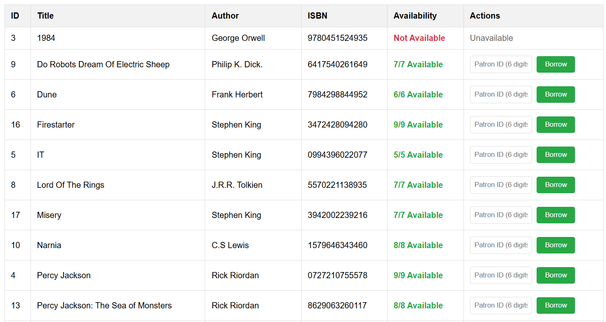

# Library Management System - Flask Web Application with SQLite 
### Assignment 3 version 
#### Queens university. Studnent num #10218216

[
[

## Overview

This project contains the basic framework for a Flask-based Library Management System with SQLite database, 
specifcally designed for CISC 327 (Software Quality Assurance) coursework. 

All of the missing functionalites have been compeleted and throughly tested using GitHub actions, and CODECOV 

Students are provided with:

- [`requirements_specification.md`](requirements_specification.md): Complete requirements document with 7 functional requirements (R1-R7)
- [`app.py`](app.py): Main Flask application with application factory pattern
- [`routes/`](routes/): Modular Flask blueprints for different functionalities
  - [`catalog_routes.py`](routes/catalog_routes.py): Book catalog display and management routes
  - [`borrowing_routes.py`](routes/borrowing_routes.py): Book borrowing and return routes
  - [`api_routes.py`](routes/api_routes.py): JSON API endpoints for late fees and search
  - [`search_routes.py`](routes/search_routes.py): Book search functionality routes
- [`database.py`](database.py): Database operations and SQLite functions
- [`library_service.py`](library_service.py): **Business logic functions** (your main testing focus)
- [`templates/`](templates/): HTML templates for the web interface
- [`requirements.txt`](requirements.txt): Python dependencies

## Database Schema
**Books Table:**
- `id` (INTEGER PRIMARY KEY)
- `title` (TEXT NOT NULL)
- `author` (TEXT NOT NULL)  
- `isbn` (TEXT UNIQUE NOT NULL)
- `total_copies` (INTEGER NOT NULL)
- `available_copies` (INTEGER NOT NULL)

**Borrow Records Table:**
- `id` (INTEGER PRIMARY KEY)
- `patron_id` (TEXT NOT NULL)
- `book_id` (INTEGER FOREIGN KEY)
- `borrow_date` (TEXT NOT NULL)
- `due_date` (TEXT NOT NULL)
- `return_date` (TEXT NULL)

### Test Cases:

This project contains test cases for the following 7 requirements. 

Referenced in the [`requirements_specification.md`](requirements_specification.md) file. 

**R1: Add Book To Catalog**: The system shall provide a web interface to add new books to the catalog:

**R2: Book Catalog Display**: The system shall display all books in the catalog in a a specifc table format

**R3: Book Borrowing Interface**: The system shall provide a borrowing interface to borrow books using the patron's library ID.

**R4: Book Return Processing**: The system shall provide a return interface and able to return a book. 

**R5: Late Fee Calculation API**: The system shall provide a system that calculates the late fee of an overdue book. 

**R6: Book Search Functionality**: The system shall provide search functionality using a search term and search type (title, author, isbn) as it's main parameters

**R7: Patron Status Report**: The system shall display patron status for a particular patron. 

**R8: Pay Late Fees**: The system shall allow patrons to pay their late fees for an overdue book. If they do have one. 

**R9: Refunds Late Payment**: The system shall allow patrons to refund their late fee, that is under 15$.

**Output examples** (Note this is somewhat outdated considering that I'm unable to run to application. 

Some books in the catalog by using the add book function. 

## Assignment Instructions
See [`student_instructions.md`](student_instructions.md) for complete assignment details.

**Resources for students:**

- [Flask Documentation](https://flask.palletsprojects.com/)
- [Test Driven Development](https://www.datacamp.com/tutorial/test-driven-development-in-python)
- [Pytest framework](https://realpython.com/pytest-python-testing/)
- [Python Blueprint](https://flask.palletsprojects.com/en/stable/blueprints)

