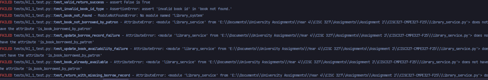
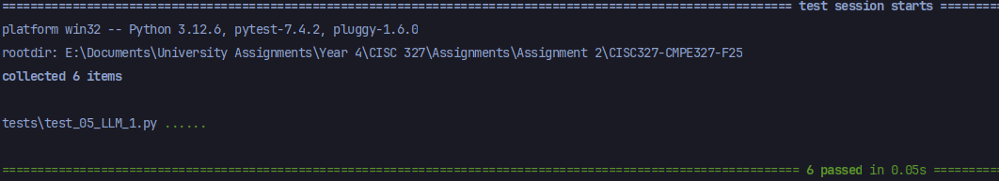
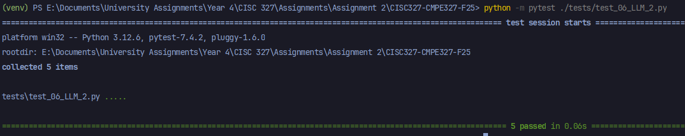
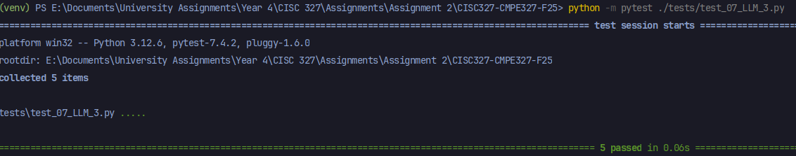
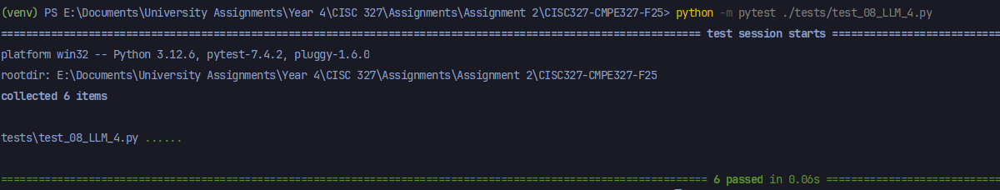

# Library Management System 
## Using LLM for additional test generation and edge case analysis.


## Overview 

This document will go through the usage of **ChatGBT LLM** of creating additional test cases for program's functionalities.
I'll be testing out the missing ones (R4 to R7) specifically since I had the implement it's missing code. 
In addition, te tests will be focusing on edge cases that might break my functionalities. 
Which I would later patch up and explain which result was the most helpful  

**The doc will be categorized on the function that I've tested**
- *Return book by patron* 
  - Test File  `test_05_LLM_1.py`
- *Calculate late fee*
- - Test File  `test_06_LLM_2.py`
- *Searching for a book*
- - Test File  `test_07_LLM_3.py`
- *Get the status report of a patron*
- - Test File  `test_08_LLM_4.py`

### Return Book by patron.

This function returns a book from a patron, while also checking the following criteria 
- If patron's library card id is valid
- If the book is available 
- Check if the patron borrowed any books
- Update the date 
- Increment the book 

Here is the first prompt that I typed in:
```
You said: 
I have a Python function called return_book_by_patron(patron_id: str, book_id: int) -> Tuple[bool, str]) 
using the variables (Patron id, which is a string of 6 numbers, and only 6 numbers, and a book_id a int value). 
The function should handle Verify book is borrowed by patron, check if the book exists or available, 
see if the patron have any borrowed books update return_date, and increment available_copies. 
Generate 10 comprehensive test cases including edge cases that might break this function s
uch as databases errors when updating the book availability (update_book_availability) which uses 
(patron id, book_id, and (update_borrow_record_return_date) which uses (patron_id, book_id, current_date) as 
it's parameters.  The current date is the date when the book is returned Format as pytest test functions 
with clear test names and assertions.
```

The result of the code that I got did not work, since when using pytest, the assertion failed and 
received errors

I edited the prompt to include more information of how the code works and the layout such as getting
the right name of the module and including snippet of code, both in the library service module and database one. 
Ultimately that created more problems. 

Below is a snipit of what the code initially looks like
```bash
def mock_book_record(book_id=3):
    """Mock database book record (dictionary form)."""
    return {
        'id': book_id,
        'title': 'The Great Gatsby',
        'author': 'F. Scott Fitzgerald',
        'isbn': '9780743273565',
        'available_copies': 2,
        'total_copies': 3
    }


def mock_borrowed_books(book_id=3):
    """Mock borrowed books list from database."""
    return [{
        'book_id': book_id,
        'title': 'The Great Gatsby',
        'author': 'F. Scott Fitzgerald',
        'borrow_date': datetime.now() - timedelta(days=10),
        'due_date': datetime.now() - timedelta(days=2),
        'is_overdue': True
    }]


# 1️⃣ Successful book return
def test_return_book_success(valid_patron_id, valid_book_id):
    """Test successful book return with valid inputs."""
    with patch("library_service.get_book_by_id", return_value=mock_book_record(valid_book_id)), \
            patch("library_service.get_patron_borrowed_books", return_value=mock_borrowed_books(valid_book_id)), \
            patch("library_service.calculate_late_fee_for_book", return_value=(True, "ok", 0)), \
            patch("library_service.update_borrow_record_return_date", return_value=True), \
            patch("library_service.update_book_availability", return_value=True):
        success, msg = return_book_by_patron(valid_patron_id, valid_book_id)
        assert success == True
        assert "successfully returned" in msg.lower()
```

Here's a screenshot of the error.



The problem is that the prompt wasn't clear or concise, which lead to lack of proper information. 
The reason why there is so many attribute errors is that the LLM 
doesn't know the right functions and proper return statements. As well as not knowing which functions
are imported and not. 

So I have rewritten the prompt again, but with more detail and clarity:
```
I have a Python function called return_book_by_patron(patron_id: str, book_id: int) which returns a tuple of  Tuple[bool, str] , the bool (success) checks if the functions succeeded or not, where as the message displays the result in a string. 
In the code it checks into different business logic functions.
 
(Valid id)
if not patron_id or not patron_id.isdigit() or len(patron_id) != 6:
        return False, "Invalid patron ID. Must be exactly 6 digits."

(Book is available)
book = get_book_by_id(book_id)
    if not book:
        return False, "Book not found."

(Checks the books borrowed)
current_borrowed = get_patron_borrow_count(patron_id)
    if current_borrowed <= 0:
        return False, "There are no books to return."

(Retrieves the late fee)
success, message, late_fee = calculate_late_fee_for_book(patron_id, book_id)
(note this function returns tuple[bool, str, float])

(Update the date)
update_date = update_borrow_record_return_date(patron_id, book_id, current_date)
    if not update_date:
         return False: "Database error..."

(update the book availability  by incrementing the books
return_success = update_book_availability(book_id, +1)  # Increment the amount of copies.
    if not return_success:
        return False, "Database error...."

the lastly returns true...
return True, (f'Successfully returned )

The function is in a file system called library_service.py which inports these criteras from a seperate module. 
from database import (
    get_book_by_id, get_book_by_isbn, get_patron_borrow_count,
    insert_book, insert_borrow_record, update_book_availability,
    update_borrow_record_return_date, get_all_books, get_patron_borrowed_books
)

Here is what the layout of the books are using conn.excute 
conn.execute('''
        CREATE TABLE IF NOT EXISTS books (
            id INTEGER PRIMARY KEY AUTOINCREMENT,
            title TEXT NOT NULL,
            author TEXT NOT NULL,
            isbn TEXT UNIQUE NOT NULL,
            total_copies INTEGER NOT NULL,
            available_copies INTEGER NOT NULL
        )
    ''')

borrow_records table
    conn.execute('''
        CREATE TABLE IF NOT EXISTS borrow_records (
            id INTEGER PRIMARY KEY AUTOINCREMENT,
            patron_id TEXT NOT NULL,
            book_id INTEGER NOT NULL,
            borrow_date TEXT NOT NULL,
            due_date TEXT NOT NULL,
            return_date TEXT,
            FOREIGN KEY (book_id) REFERENCES books (id)
        )
  )

Generate 5 comprehensive test cases including edge cases that might break this function. (Database errors)
Format as pytest test functions with clear test names and assertions.
```

In the prompt included how the code runs including the functions that was called within it.
I added what functions the library_service.py is importing and the database schema of how the book info
is organized. 
This is better clarification. 

Here is the snippet of the code that was returned. Specifically on the parts where it tests the edge cases.

```bash
# 2️⃣ Book Not Found in Database
@patch("library_service.get_book_by_id", return_value=None)
def test_return_book_not_found(mock_get_book):
    """Should fail when the book ID does not exist in the database."""
    success, message = return_book_by_patron("123456", 999)
    assert not success
    assert message == "Book not found."
    mock_get_book.assert_called_once_with(999)


# 3️⃣ Patron Has No Books Borrowed
@patch("library_service.get_book_by_id", return_value={"id": 1, "title": "Book A"})
@patch("library_service.get_patron_borrow_count", return_value=0)
def test_return_book_no_books_borrowed(mock_borrow_count, mock_get_book):
    """Should fail when patron has no books currently borrowed."""
    success, message = return_book_by_patron("123456", 1)
    assert not success
    assert message == "There are no books to return."
    mock_get_book.assert_called_once()
    mock_borrow_count.assert_called_once_with("123456")

# 4️⃣ Database Error: Return Date Update Fails
@patch("library_service.get_book_by_id", return_value={"id": 1, "title": "Book A"})
@patch("library_service.get_patron_borrow_count", return_value=1)
@patch("library_service.calculate_late_fee_for_book", return_value=(True, "Late fee calculated", 0.0))
@patch("library_service.update_borrow_record_return_date", return_value=False)
def test_return_book_update_date_failure(
        mock_update_date, mock_calc_fee, mock_borrow_count, mock_get_book
):
    """Should fail when the database fails to update the return date."""
    success, message = return_book_by_patron("123456", 1)
    assert not success
    assert "Database error" in message
    mock_update_date.assert_called_once()
```

When running the pytest on the file, it works perfectly without any assertion errors. 



It's worth noting that all the code examples shown uses @patch, which is a decorator in pytest
to crate a mock object for testing. This is especially beneficial on making the code 
independent so it would not require of effect the program's dependencies. 

This process is mostly prevalent on testing out the edge cases for the functions as 
it requires using the database itself to create these errors. 
Using @patch is both helpful and valuable as it won't alter or break the database, along with getting the right 
results. 

### Calculate late Fee.

The next function is getting the calculating the late fee for books that are overdue. 
Which follows these criteria:
- If patron's library card id is valid
- If the book is available 
- Check if the patron borrowed any books
- Check if the book is overdue
  - If the book is overdue add 1.00 per day
  - else return 0 

I added on to the previous prompt with this follow up. The same prompt structure is the same,
introduce what the function it is, the return statements, and an overview of its business logic. 

```
Can you make another function to create 5 test cases on.
This time using the function def calculate_late_fee_for_book(patron_id: str, book_id: int). Again like i mentioned prior this returns the Boolean, a string message, and float value of the total cost.

The variable total_cost is the float value, which is set to 0.00
In the code it checks into different business logic functions. 
(Valid id) 
if not patron_id or not patron_id.isdigit() or len(patron_id) != 6: return False, "Invalid patron ID. Must be exactly 6 digits."

(checks if the book exists)

book = get_book_by_id(book_id)
    if not book:
        return False, "Book not found.", total_cost

(checks if the patron has borrowed any books)
patron_info = get_patron_borrowed_books(patron_id)
    id_list = {books['book_id'] for books in patron_info}
    if book_id not in id_list:
        return False, "The book not borrowed", total_cost

(Note the patron info is a dict which follows this format, which is called from database)
'book_id': record['book_id'],
            'title': record['title'],
            'author': record['author'],
            'borrow_date': datetime.fromisoformat(record['borrow_date']),
            'due_date': datetime.fromisoformat(record['due_date']),
            'is_overdue': datetime.now() > datetime.fromisoformat(record['due_date'])


(Gets the current time and due date of the the book)
current_date = datetime.now()
    due_date = next((book['due_date'] for book in patron_info if book['book_id'] == book_id),
                    None)

Gets the days overdue 
days_overdue = (current_date - due_date).days

If the days are over due or (days_overdue > 0)
Increments by 1.00
and prints out    
return True, f"Book is overdue.." total_cost

otherwise
prints out 
return True f"Book is not overdue..." 0.00

Like before create 5 test cases that focus on the edge cases, especially database errors to see the function break. 
```
The code that I received worked but there was a problem, I get an error on the last part where
it tested out the edge case handling. The main issue was that there was no 
**statement** that catches or properly acknowledges the database error itself. 
Below is a snippet of what the error had said 

```
Should handle unexpected database failure gracefully instead of raising TypeError.
patron_info returns None (simulating database query failure).
"""
# --- Defensive try/catch if the current implementation is unprotected ---
try:
success, message, fee = calculate_late_fee_for_book("123456", 1)
except TypeError:
>           pytest.fail("Function crashed with TypeError when patron_info is None")
E           Failed: Function crashed with TypeError when patron_info is None

```

I asked ChatGbt for some suggestions on fixing this error and what provided was to edit the calculate late
function to include a statement that handles edge cases. 
Here it checks if the borrow_records for the patron exists, otherwise returns false if it doesn't

```bash
# Recommended by ChatGbt for AI-Assisted Test Generation in task 3 to test out database errors.
if not patron_info or not isinstance(patron_info, list):
    return False, "Database error: could not retrieve borrowed books.", total_cost
```

After editing the code and the test_case, when using `pytest`, all assertion passed. 



Below is a screenshot of the code that tests the edge case,

```bash
@patch("library_service.get_book_by_id", return_value={"id": 1, "title": "Book A"})
@patch("library_service.get_patron_borrowed_books", return_value=None)
def test_calculate_late_fee_database_failure(mock_borrowed_books, mock_get_book):
    """Should handle unexpected database failure gracefully instead of raising TypeError."""
    success, message, fee = calculate_late_fee_for_book("123456", 1)
    assert not success
    assert "database error" in message.lower()
    assert fee == 0.00
    mock_get_book.assert_called_once()
    mock_borrowed_books.assert_called_once_with("123456")

```
For ths function I find the edge cases to be the most valuable, because these cases
tests the functional capabilities and sees of it breaks. Furthermore, it allows me 
to properly implement any safeguards on handling these errors without 
the program from crashing.

The same notion applies for the rest of the generated test cases. 

### Searching for books.

This code searches for books within the catalog with a
search functionality that uses the following parameters:
- A search term `str`
- A search type `str` (title, author, isbn)
- Support partial matching for title/author (case-insensitive)
- Support exact matching for ISBN
- Return results in same format as catalog display

Below is the prompt used following 

```
Can you make another function to create 5 test cases on. This time using the function def search_books_in_catalog(search_term: str, search_type: str) which returns these criterias tuple[bool, str, list[Any]. The bool checks for the success of the function, the string gets the info and the list carries the book information.  The search term is literly what the the patron is looking for and the type is the type that they are searching. (Title, Author, ISBN)

Here is the rundown of what the code looks like. 
The book results are listed in book_results = []
search_type = search_type.lower()  both converts the term into lowercase for partial matching
search_term = search_term.lower()  
complete_catalog = get_all_books() Gets al the books in the catalog

(Checks if the term is empty)
 if not search_term or not search_term.strip():
        return False, "Search input must not be empty" []

(Invalid search)
    if search_type not in ('title', 'author', 'isbn'):
        return False, "Invalid search type: Valid ones are ('title', 'author', 'isbn')", []

(Isbn searching) Does precise matching!
 if search_type == 'isbn':
        book_result = get_book_by_isbn(search_term)
         if not book_result: ...
returns false and this statement  "Book not found." and an empty list
otherwise will append the book in the book_results = []

(Title searching) Partial matching
    if search_type == 'author':
        for books in complete_catalog:
            if search_term in books['author'].lower(): ( In lowercase so it wouldn't be case senstive)
                book_results.append(books)

(Author serarching) Partial matching
    if search_type == 'title':
        for books in complete_catalog: 
            if search_term in books['title'].lower(): 
                book_results.append(books)

 if not book_results: (If books are not found)
        return False, "No matching books are found.", []

Otherwise 
returns true, "List of books found..." and the book results list.

Like before follow the format above and check for database errors/ edge cases. 

```

Like in the previous prompt, I got the same error in regards for not handling the edge cases properly 
so I added the missing business logic in the function. 

```bash
# Recommended by ChatGbt for AI-Assisted Test Generation in task 3 to test out database errors.
if not patron_info or not isinstance(patron_info, list):
    return False, "Database error: could not retrieve borrowed books.", total_cost
```

Here is the snippet of the code that tests the edge case. 

```bash
@patch("library_service.get_all_books", return_value=None)
def test_search_books_database_failure(mock_get_all_books):
    """Should handle None response from database gracefully instead of crashing."""
    success, message, results = search_books_in_catalog("harry", "title")

    assert not success
    assert "database error" in message.lower()
    assert results == []
    mock_get_all_books.assert_called_once()
``` 
When running `pytest` all of them passed thoroughly. 



### Showing the patron's records
The final missing function allows the system to show the patron's borrow records
along with following these factors:
- Current borrowed books with due dates
- Total late fees owed  
- Number of books currently borrowed

Below is the prompt that I used to for ChatGBT. Though this time I mentioned the 
safeguards that catches the edge cases, that was absent when typing in the previous prompt.

```
Can you create 5 test cases for the final function called  get_patron_status_report(patron_id: str)  which returns a Tuple[bool, str, Dict] which returns a bool that checks for the sucess, a message, and a dict that displays the list of book directories.
Which includes a List currently borrowed books, calculate total late fees, show due dates

The business logic goes as follows. 
book_list = [] -> The list of books
due_dates = [] -> the list of duedates
total_late_fee_sum = [] -> The total fee of the books. 

(Checks for a valid user)
if not patron_id or not patron_id.isdigit() or len(patron_id) != 6:
       return False, "Invalid patron ID. Must be exactly 6 digits.", {}

Gets the information of the patron (might need to change to work for edge cases)
patron_info = get_patron_borrowed_books(patron_id)
    if patron_info is None:  # Checks if the user does exist
        return False, "Patron not existent", {} (empty dict)
    elif len(patron_info) == 0:  # Checks if there are any books that the patron has borrowed
        return False, "Patron does not have any borrowed books", {}

If there are books to be stored then it follows these steps.
else:...
for books in patron_info:
title = books['title'] (retrives the title)

patron_book_id = books['book_id'] (gets the book id)

success, message, late_fee = calculate_late_fee_for_book(patron_id, patron_book_id) (calculate late fee)
book_barrow_date = books['borrow_date'].strftime("%Y-%m-%d")  (gets the book borow date)
book_due_date = books['due_date'].strftime("%Y-%m-%d") (gets the book due date)

 check_overdue = f"Is Overdue" if books['is_overdue'] else f"Is not Overdue."

 book_group = ("Title-", title, "ID-", patron_book_id) [create a tuple for the book's info]
 date_group = ("Title-", title, "Borrowed date-", book_barrow_date, "Due date-", book_due_date,
                          check_overdue) [creates a tuple for the duedates]
 book_list.append(book_group) [Append them into their respected lists]
 due_dates.append(date_group)

total_late_fee_sum.append(late_fee) 

Then outside the for loop

 total_fee_sum = sum(total_late_fee_sum) = gets the total sum

(Create a dict that shows all of the info)
patron_status = {'Borrowed books': book_list, 'Due dates': due_dates, 'Total fee': total_fee_sum}

return True, (f"List of books currently borrowed:...) and the dict. 

Like before gives me a # ✅ Defensive guard in case it fails.
And also focus and the edge cases

```

I added this, so I wouldn't need edit the code that I've got for this 
functionality. This is because that when getting the necessary information, 
such as the title, due date, and borrowing date from the database, all of these function calls
need to contain an edge case statement.

When asking ChatGBT about where to implement these safeguards that catches these 
edge cases it gave me a suggestion to rewrite the code entirely. 
This would possibly pose a risk of breaking the function. 

Here is a snippet of the edge case code used in the test suite. 
```bash
# --- 5. Patron Has Overdue Book(s) + Database Defensive Guard ---
@patch("library_service.get_patron_borrowed_books")
@patch("library_service.calculate_late_fee_for_book")
def test_patron_overdue_books_and_database_error(mock_calc_fee, mock_borrowed_books):
    """Should handle overdue books correctly and sum late fees."""
    from library_service import get_patron_status_report

    today = datetime.now()
    mock_borrowed_books.return_value = [
        {
            "title": "Advanced Python",
            "book_id": "B777",
            "borrow_date": today - timedelta(days=15),
            "due_date": today - timedelta(days=5),
            "is_overdue": True,
        },
        {
            "title": "Data Science with Pandas",
            "book_id": "B778",
            "borrow_date": today - timedelta(days=20),
            "due_date": today - timedelta(days=10),
            "is_overdue": True,
        },
    ]

    # Return two different late fees for each book
    mock_calc_fee.side_effect = [
        (True, "Late by 5 days", 2.5),
        (True, "Late by 10 days", 5.0),
    ]

    success, message, report = get_patron_status_report("123456")

    assert success
    assert "List of books currently borrowed" in message
    assert isinstance(report, dict)
    assert "Total fee" in report
    assert report["Total fee"] == 7.5  # 2.5 + 5.0
    assert len(report["Borrowed books"]) == 2

```

When running `pytest` all the assertions ran smoothly. 



## Conclusion

In summery, the usage of LLM on creating test cases is 
proven useful as long as the right amount of detail is written 
in the prompt. Providing clear information and results that the LLM might observe so
their won't be any confusion on creating the right test functions. 

LLM, also utilizes `patch@` to make the code independent when testing 

Finally, the most valuable test cases that are generated were the ones 
that handles the edge cases, since it allows me to observe any crashes that it made
so, I could later edit the code on preventing them from happening. 
